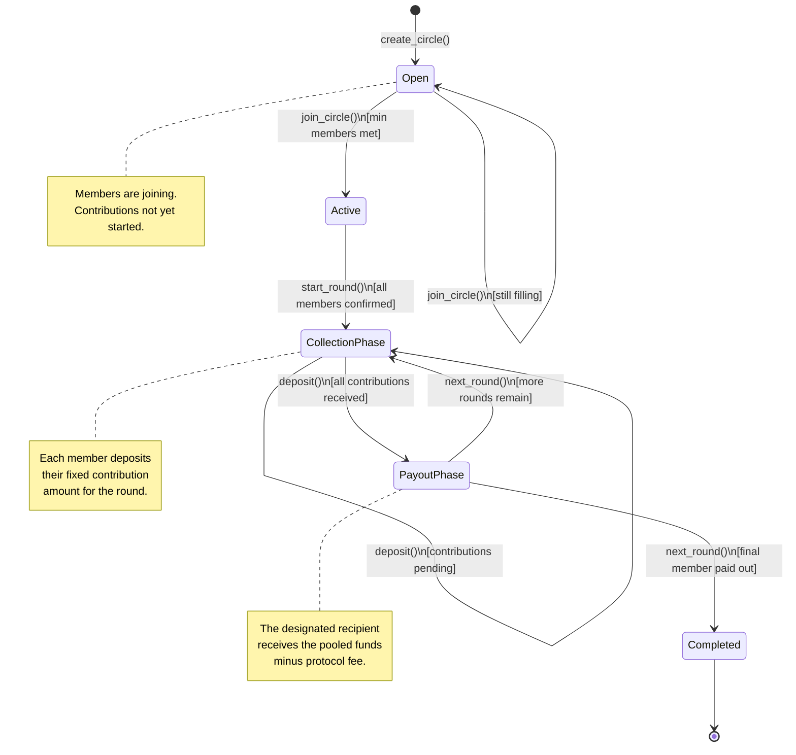

# VeriNode--Core: Decentralized Savings Circle

A trustless Rotating Savings and Credit Association (ROSCA) built on Stellar Soroban.

## Table of Contents

- [Overview](#overview)
- [Deployed Contract](#deployed-contract)
- [Protocol Fee (Monetization)](#protocol-fee-monetization)
- [Contracts API Reference](#contracts-api-reference)
- [Features](#features)
  - [Implementation Summary](#implementation-summary)
  - [Collateralized Entry Barrier](#collateralized-entry-barrier)
  - [Buddy System](#buddy-system)
  - [Emergency Withdrawal](#emergency-withdrawal)
  - [Events Implementation](#events-implementation)
  - [Leniency Vote System](#leniency-vote-system)
  - [Quadratic Voting for Large Groups](#quadratic-voting-for-large-groups)
  - [Rate-Limited Group Creation](#rate-limited-group-creation)
- [Formal Verification Specification](#formal-verification-specification)
- [Testing](#testing)
  - [Graceful Exit Test Plan](#graceful-exit-test-plan)
  - [Hyper-Inflationary Scenario Testing](#hyper-inflationary-scenario-testing)
- [Troubleshooting](#troubleshooting)
- [How to Build](#how-to-build)

---

## Overview

### Deployed Contract

- **Network:** Stellar Mainnet
- **Contract ID:** CAH65U2KXQ34G7AT7QMWP6WUFYWAV6RPJRSDOB4KID6TP3OORS3BQHCX

### Features

- Create savings circles with fixed contribution amounts
- Join existing circles
- Deposit USDC/XLM securely
- Automated payouts (Coming Soon)

---

## Protocol Fee (Monetization)

The protocol takes a configurable fee from every payout (e.g. 0.5%).

- **fee_basis_points**: Fee rate in basis points (e.g. `50` = 0.5%). Set via `set_protocol_fee` (admin only). Capped at 10,000 (100%).
- **treasury_address**: Recipient of the fee. Set together with the fee; required when fee > 0.
- Payouts deduct the fee from the payout amount: the recipient receives `payout_amount - fee`, and the fee is transferred to `treasury_address`.

After deploy, call `initialize(admin)` once, then `set_protocol_fee(fee_basis_points, treasury)` to enable fees. When implementing the payout flow, use `compute_and_transfer_payout(env, token, from, recipient, gross_payout)` so every payout is fee-deducted and the fee is sent to the treasury.

---

## Contracts API Reference

### Savings Group Lifecycle

The diagram below shows the full lifecycle of a savings group, from creation through to final payout.



### State Descriptions

| State | Description |
|---|---|
| **Open** | The circle has been created and is accepting new members. |
| **Active** | The minimum required members have joined; the circle is confirmed and ready to begin rounds. |
| **Collection Phase** | Members are depositing their fixed contribution for the current round. |
| **Payout Phase** | All contributions are in; the pooled funds are disbursed to the round's designated recipient. |
| **Completed** | Every member has received a payout. The circle is closed. |

### Public Function Signatures

#### Admin / Initialization

##### `initialize`
```rust
pub fn initialize(env: Env, admin: Address)
```
Initialises the contract and sets the admin address. Must be called once immediately after deployment. Subsequent calls will panic.

- `env` — Soroban environment handle
- `admin` — Address of the protocol administrator

##### `set_protocol_fee`
```rust
pub fn set_protocol_fee(env: Env, fee_basis_points: u32, treasury: Address)
```
Sets the protocol fee rate and the treasury address that receives fees. Admin-only.

- `fee_basis_points` — Fee in basis points (e.g. `50` = 0.5%). Capped at `10_000` (100%).
- `treasury` — Address that receives the collected fee. Required when `fee_basis_points > 0`.

Panics with `InvalidFeeConfig` if `fee_basis_points > 10_000` or if `fee_basis_points > 0` and `treasury` is not set.

#### Circle Management

##### `create_circle`
```rust
pub fn create_circle(
    env: Env,
    creator: Address,
    contribution_amount: i128,
    max_members: u32,
    token: Address,
) -> u64
```
Creates a new savings circle. Returns the new `circle_id`.

- `creator` — Address of the member creating the circle
- `contribution_amount` — Fixed amount each member must contribute per round
- `max_members` — Maximum number of participants allowed
- `token` — Contract address of the token used for contributions (e.g. USDC)

##### `join_circle`
```rust
pub fn join_circle(env: Env, member: Address, circle_id: u64)
```
Adds a member to an existing circle. The circle must be in `Open` state.

- `member` — Address of the member joining
- `circle_id` — ID of the target circle

Panics with `CircleNotFound` if the ID is invalid, `AlreadyJoined` if the member is already part of the circle, or `Unauthorized` if the circle is no longer accepting members.

#### Round Operations

##### `start_round`
```rust
pub fn start_round(env: Env, admin: Address, circle_id: u64)
```
Transitions the circle from `Active` into `CollectionPhase` for the first round (or advances to the next round after a payout). Admin-only.

- `admin` — Admin address (must match the stored admin)
- `circle_id` — ID of the target circle

##### `deposit`
```rust
pub fn deposit(env: Env, member: Address, circle_id: u64)
```
Records a member's contribution for the current round. The member must have approved the contract to transfer at least `contribution_amount` of the circle's token before calling this function.

- `member` — Address of the depositing member
- `circle_id` — ID of the target circle

Panics with `InsufficientAllowance` if the token allowance is too low, or `Unauthorized` if the caller is not a circle member.

> **Token approval:** Before calling `deposit`, the member must call `approve()` on the token contract, authorising this contract to spend at least `contribution_amount`.

##### `trigger_payout`
```rust
pub fn trigger_payout(env: Env, admin: Address, circle_id: u64)
```
Executes the payout for the current round once all contributions have been collected. Transfers `payout_amount - fee` to the designated recipient and `fee` to the treasury. Admin-only.

- `admin` — Admin address
- `circle_id` — ID of the target circle

Panics with `CycleNotComplete` if not all members have deposited.

#### Internal Helpers

##### `compute_and_transfer_payout`
```rust
pub fn compute_and_transfer_payout(
    env: &Env,
    token: Address,
    from: Address,
    recipient: Address,
    gross_payout: i128,
) -> i128
```
Computes the net payout after deducting the protocol fee, transfers the net amount to `recipient`, and sends the fee to the treasury. Returns the net amount transferred.

This function should be used by any custom payout logic to ensure all payouts are fee-deducted consistently.

#### Query Functions

##### `get_circle`
```rust
pub fn get_circle(env: Env, circle_id: u64) -> Circle
```
Returns the full state of a circle by ID.

Panics with `CircleNotFound` if the ID does not exist.

##### `get_members`
```rust
pub fn get_members(env: Env, circle_id: u64) -> Vec<Address>
```
Returns the list of member addresses for a given circle.

##### `get_contribution_status`
```rust
pub fn get_contribution_status(env: Env, circle_id: u64) -> Map<Address, bool>
```
Returns a map of each member's contribution status (`true` = deposited) for the current round.

---

## Features

### Implementation Summary

#### Randomized Payout Order (Issue #23)

**Acceptance Criteria Met:**
- Added `is_random_queue` boolean to group config
- Use Soroban's Pseudo-Random Number Generator (`env.prng().shuffle()`) to reorder the members vector
- Store the finalized `payout_queue` in the contract state

**Key Functions:**
- `create_circle()` — Now accepts `is_random_queue` parameter
- `finalize_circle()` — Creates the payout queue using random shuffle if enabled
- `get_payout_queue()` — Returns the finalized payout order

#### Group Rollover (Multi-Cycle Savings) (Issue #24)

**Acceptance Criteria Met:**
- Implemented `rollover_group()` function
- Reset all `has_received_payout` flags to false
- Increment the global `cycle_number`
- Retain the existing member list and contribution rules

**Key Functions:**
- `rollover_group()` — Resets the group for the next cycle
- `get_cycle_number()` — Returns the current cycle number
- `get_payout_status()` — Returns payout status for all members

#### Enhanced Circle Structure

```rust
pub struct Circle {
    admin: Address,
    contribution: i128,
    members: Vec<Address>,
    is_random_queue: bool,
    payout_queue: Vec<Address>,
    cycle_number: u32,
    has_received_payout: Vec<bool>,
}
```

#### New Error Types

```rust
pub enum Error {
    // ... existing errors
    CircleNotFinalized = 1007,
}
```

#### Function Signatures

**Core Functions**
- `create_circle(env: Env, contribution: i128, is_random_queue: bool) -> u32`
- `join_circle(env: Env, circle_id: u32)`
- `finalize_circle(env: Env, circle_id: u32)`
- `rollover_group(env: Env, circle_id: u32)`

**Query Functions**
- `get_payout_queue(env: Env, circle_id: u32) -> Vec<Address>`
- `get_cycle_number(env: Env, circle_id: u32) -> u32`
- `get_payout_status(env: Env, circle_id: u32) -> Vec<bool>`

#### Usage Flow

1. **Create Circle**: Admin creates circle with `is_random_queue` option
2. **Join Members**: Members join the circle
3. **Finalize**: Admin calls `finalize_circle()` to create payout queue
4. **Payout Cycle**: Payouts occur according to the queue
5. **Rollover**: Admin calls `rollover_group()` to start next cycle

#### Security & Fairness

- Admin-only operations: `finalize_circle()` and `rollover_group()` require admin permissions
- Random shuffle uses Soroban's cryptographically secure PRNG
- State validation: Rollover only allowed after all members receive payouts
- Immutable member list preserved across cycles

---

### Collateralized Entry Barrier

#### Overview

A collateral vault system that requires members to lock a percentage of the total cycle value before participating in high-value Susu groups. This creates a "Financial Commitment" layer that protects the integrity of the group and mitigates the risk of "payout and run" scenarios.

#### Architecture

**Key Components**

1. **Automatic High-Value Detection**: Circles with total cycle value >= 1000 XLM automatically require collateral
2. **Collateral Vault**: Secure storage for member collateral funds
3. **Slashing Mechanism**: Automatic redistribution of defaulted member collateral
4. **Auto-Release System**: Collateral released upon successful completion

**Data Structures**

```rust
pub struct CollateralInfo {
    pub member: Address,
    pub circle_id: u64,
    pub amount: i128,
    pub status: CollateralStatus,
    pub staked_timestamp: u64,
    pub release_timestamp: Option<u64>,
}
```

**CollateralStatus**
- `NotStaked`: Initial state
- `Staked`: Collateral locked and active
- `Slashed`: Collateral confiscated due to default
- `Released`: Collateral returned to member

**MemberStatus (Extended)**
- `Active`: Member in good standing
- `AwaitingReplacement`: Member being replaced
- `Ejected`: Member removed from circle
- `Defaulted`: Member failed to meet obligations (NEW)

#### Constants

```rust
const DEFAULT_COLLATERAL_BPS: u32 = 2000; // 20%
const HIGH_VALUE_THRESHOLD: i128 = 1_000_000_0; // 1000 XLM
```

#### Core Functions

1. **stake_collateral(env, user, circle_id, amount)** — Locks collateral funds before joining a high-value circle.
2. **slash_collateral(env, caller, circle_id, member)** — Confiscates collateral from defaulted members and redistributes to group (circle creator or admin only).
3. **release_collateral(env, caller, circle_id, member)** — Returns collateral to members who complete all contributions.
4. **mark_member_defaulted(env, caller, circle_id, member)** — Marks a member as defaulted and triggers automatic collateral slashing.

#### Integration Points

- **Circle Creation**: Automatic collateral requirement calculation based on total cycle value
- **Join Circle**: Collateral verification before joining
- **Claim Pot**: Auto-release collateral upon completion

#### Security Considerations

1. **Access Control**: Only circle creators or admins can slash collateral
2. **State Validation**: Collateral status transitions strictly enforced
3. **Economic Security**: 20% collateral provides significant skin in the game
4. **Attack Vectors Mitigated**: Payout and run, Sybil attacks, default risk

#### Gas Optimization

Uses compact data structures, status enums minimize storage overhead, and auto-release reduces manual transactions.

#### Future Enhancements

1. **Dynamic Collateral Rates**: Tiered collateral rates based on total value
2. **Collateral Insurance**: Premium-based insurance pool against collateral loss
3. **Graduated Release**: 25% release after each successful contribution

---

### Buddy System

#### Overview

The buddy system allows two members to pair their accounts for mutual payment protection. If one member misses a payment, the system automatically checks for a "Safety Deposit" from their paired member to cover the gap and prevent group penalties.

#### Data Keys

- `BuddyPair(Address)`: Maps member address to their buddy's address
- `SafetyDeposit(Address, u64)`: Tracks safety deposits by member and circle ID

#### New Functions

- **pair_with_member(user, buddy_address)** — Pairs a member with another active member as their buddy
- **set_safety_deposit(user, circle_id, amount)** — Deposits tokens as safety backup for buddy

#### Modified Functions

- **deposit(user, circle_id)** — Enhanced with buddy system fallback logic: if primary member's payment fails, checks buddy's safety deposit to cover

#### Usage Flow

1. **Pairing**: Member A calls `pair_with_member()` to pair with Member B
2. **Safety Deposit**: Member B calls `set_safety_deposit()` to provide backup funds
3. **Payment Protection**: When Member A's payment fails, system uses Member B's safety deposit
4. **Deposit Management**: Safety deposits are reduced by used amounts

---

### Emergency Withdrawal

#### Summary

Emergency withdrawal safety mechanism for the VeriNode savings contract.

#### Implementation Details

1. **Last Active Timestamp Variable** — Added `LastActiveTimestamp` to `DataKey` enum, stored in instance storage, updates on initialization and admin actions.

2. **Emergency Withdraw Function**
```rust
pub fn emergency_withdraw(env: Env, user: Address, token_address: Address)
```
- Requires user authentication
- Checks if `current_time > last_active_timestamp + 7_DAYS`
- Allows withdrawal of exact principal balance
- No admin signature required after time limit expires

#### Storage Architecture
- `LastActiveTimestamp`: Instance storage (u64)
- `UserBalance`: Persistent storage (i128)
- `Admin`: Instance storage (Address)

#### Test Coverage
- test_emergency_withdraw_after_seven_days — User can withdraw after 7 days
- test_emergency_withdraw_before_seven_days — Withdrawal fails before limit
- test_admin_action_updates_timestamp — Admin actions reset timer

---

### Events Implementation

#### Issue #25: Events — Emit CycleCompleted and GroupRollover

**Acceptance Criteria Met:**
- Emit `CycleCompleted(group_id, total_volume_distributed)` when last member gets paid
- Emit `GroupRollover(group_id, new_cycle_number)` when admin restarts the group

#### Event Structures

```rust
pub struct CycleCompletedEvent {
    group_id: u32,
    total_volume_distributed: i128,
}
```
- **Trigger**: Last member of a cycle receives payout
- **Symbol**: `CYCLE_COMP`

```rust
pub struct GroupRolloverEvent {
    group_id: u32,
    new_cycle_number: u32,
}
```
- **Trigger**: Admin calls `rollover_group()`
- **Symbol**: `GROUP_ROLL`

#### Enhanced Circle Structure

```rust
pub struct Circle {
    admin: Address,
    contribution: i128,
    members: Vec<Address>,
    cycle_number: u32,
    current_payout_index: u32,
    has_received_payout: Vec<bool>,
    total_volume_distributed: i128,
}
```

#### Backend Integration

Backend systems can monitor these events to update historical leaderboards, track group performance metrics, maintain real-time UI state synchronization, and calculate analytics on volume distribution.

#### Security Features

- Admin-only operations for payouts and rollovers
- Duplicate prevention: members cannot receive payout twice in same cycle
- Cycle completion validation before rollover
- Member verification for payouts

---

### Leniency Vote System

#### Overview

The Leniency Vote system introduces a governance layer that allows Susu group members to request 48-hour grace period extensions through democratic voting. This feature humanizes the smart contract by acknowledging that "life happens" while maintaining the security and integrity of the underlying escrow system.

#### Key Constants

```rust
const LENIENCY_GRACE_PERIOD: u64 = 172800; // 48 hours in seconds
const VOTING_PERIOD: u64 = 86400; // 24 hours voting period
const MINIMUM_VOTING_PARTICIPATION: u32 = 50; // 50% minimum participation
const SIMPLE_MAJORITY_THRESHOLD: u32 = 51; // 51% simple majority
```

#### Data Structures

```rust
pub struct LeniencyRequest {
    pub requester: Address,
    pub circle_id: u64,
    pub request_timestamp: u64,
    pub voting_deadline: u64,
    pub status: LeniencyRequestStatus,
    pub approve_votes: u32,
    pub reject_votes: u32,
    pub total_votes_cast: u32,
    pub extension_hours: u64,
    pub reason: String,
}
```

**LeniencyRequestStatus**: `Pending`, `Approved`, `Rejected`, `Expired`

**SocialCapital** — Tracks trust scores based on voting behavior.

#### Core Functions

1. **request_leniency(env, requester, circle_id, reason)** — Initiates a grace period request
2. **vote_on_leniency(env, voter, circle_id, requester, vote)** — Casts a vote
3. **finalize_leniency_vote(env, caller, circle_id, requester)** — Finalizes after deadline
4. **get_leniency_request(env, circle_id, requester)** — Query status
5. **get_social_capital(env, member, circle_id)** — Query trust metrics
6. **get_leniency_stats(env, circle_id)** — Query group statistics

#### Trust Score Calculation

Starting score: 50. Voting to approve: +2 points. Voting to reject: -1 point. Receiving leniency: +5 points. Bounds: 0 (minimum) to 100 (maximum).

#### Governance Rules

- All active members except requester can vote; one vote per member per request
- Minimum 50% participation, 51% simple majority
- Early finalization when majority reached; requests expire if minimum not met
- One pending request per member at a time

#### Integration with Late Fee System

When leniency is approved, original deadline extended by 48 hours, grace period end updated, late fees suppressed until grace period expires.

---

### Quadratic Voting for Large Groups

#### Overview

Quadratic Voting prevents wealthy members from dominating group decisions by implementing a quadratic cost function for voting power. Influence grows proportionally to the square root of token holdings, creating a more democratic decision-making process for large Susu groups.

#### Key Constants

```rust
const QUADRATIC_VOTING_PERIOD: u64 = 604800; // 7 days for rule changes
const QUADRATIC_QUORUM: u32 = 40; // 40% quorum
const QUADRATIC_MAJORITY: u32 = 60; // 60% supermajority
const MAX_VOTE_WEIGHT: u32 = 100; // Maximum quadratic vote weight
const MIN_GROUP_SIZE_FOR_QUADRATIC: u32 = 10; // Enable for groups >= 10
```

#### Data Structures

```rust
pub struct Proposal {
    pub id: u64,
    pub circle_id: u64,
    pub proposer: Address,
    pub proposal_type: ProposalType,
    pub title: String,
    pub description: String,
    pub created_timestamp: u64,
    pub voting_start_timestamp: u64,
    pub voting_end_timestamp: u64,
    pub status: ProposalStatus,
    pub for_votes: u64,
    pub against_votes: u64,
    pub total_voting_power: u64,
    pub quorum_met: bool,
    pub execution_data: String,
}
```

**ProposalType**: `ChangeLateFee`, `ChangeInsuranceFee`, `ChangeCycleDuration`, `AddMember`, `RemoveMember`, `ChangeQuorum`, `EmergencyAction`

#### Quadratic Voting Mathematics

- **Voting Power**: sqrt(token_balance)
- **Vote Cost**: weight²
- **Wealth Influence**: 10x wealth = sqrt(10x) ≈ 3.16x influence

#### Core Functions

1. **create_proposal(env, proposer, circle_id, type, title, description, execution_data)**
2. **quadratic_vote(env, voter, proposal_id, vote_weight, vote_choice)**
3. **execute_proposal(env, caller, proposal_id)**
4. **update_voting_power(env, member, circle_id, token_balance)**

#### Governance Rules

- Quadratic voting enabled for circles >= 10 members
- 40% quorum required; 60% supermajority for passage
- 7-day voting period; maximum vote weight of 100

---

### Rate-Limited Group Creation

#### Overview

To prevent spam attacks where malicious actors create thousands of empty "zombie groups" to bloat the network, a rate limiting mechanism on circle creation has been implemented.

#### Rate Limit Parameters

- **Cooldown Period**: 5 minutes (300 seconds)
- **Scope**: Per creator address
- **Enforcement**: Transaction reverts if rate limit is violated

#### Storage

```rust
DataKey::LastCreatedTimestamp(Address)
```

#### Logic Flow

1. Check last creation timestamp
2. If elapsed time < 300 seconds, revert
3. On success, update timestamp
4. Continue with normal creation logic

#### Security Benefits

- Attackers limited to 12 circles per hour per address
- To create 1000 circles: requires 84 addresses or 7 hours

#### User Experience

- First circle: no delay
- Subsequent circles: 5-minute wait
- Each address has independent rate limit

#### Alternative Approaches Considered (Not Implemented)

1. **Creation Fee** — Economic deterrent but barrier for legitimate users
2. **Reputation System** — Flexible but complex implementation
3. **Admin Whitelist** — Centralized, doesn't scale

---

## Formal Verification Specification

### Safety Invariants

#### 1. Vault Balance Integrity

```
vault_balance(circle_id, token) = total_deposits(circle_id, token) - total_payouts(circle_id, token)
```

Verification points: after `deposit()`, after `payout()`, after `compute_and_transfer_payout()`.

#### 2. Fee Consistency

```
fee = (payout_amount * fee_basis_points) / 10000
fee_basis_points <= 10000
net_payout = payout_amount - fee >= 0
```

#### 3. Contribution Completeness

A payout can only occur when all members have contributed for the current cycle.

#### 4. Member Uniqueness

Each member can join a circle at most once.

#### 5. Non-Negative Balances

All vault_balance, total_deposits, total_payouts must remain >= 0.

### State Transition Properties

- **Deposit**: vault_balance += amount, total_deposits += amount, contributions_count += 1
- **Payout**: fee deducted, vault_balance -= gross_payout, treasury receives fee

### Authorization Properties

- Admin-only: `initialize`, `set_protocol_fee`
- Member-only: `deposit`

### Liveness Properties

If all members contribute, a payout must be possible.

### Verification Tool Integration

- **Halmos**: Symbolic testing for `deposit()`, `compute_and_transfer_payout()`, `set_protocol_fee()`
- **Certora**: Rules for vaultBalanceIntegrity, feeConsistency, noNegativeBalances, authorizationCheck

---

## Testing

### Graceful Exit Test Plan

#### Test Cases for `request_exit()`

1. **Happy Path**: Active member requests exit — status changes to AwaitingReplacement, PendingExit created
2. **Error Cases**: Non-member, already awaiting, or ejected member should panic

#### Test Cases for `fill_vacancy()`

1. **Happy Path**: Exiting member receives refund, new member inherits position, NFT transferred
2. **Error Cases**: No pending exit, wrong state, new member already in circle

#### Integration Tests

1. **Full Graceful Exit Flow**: Join, contribute, request exit, fill vacancy
2. **Queue Position Preservation**: New member inherits the exiting member's position

#### Security Considerations

- Authorization checks with `require_auth()`
- State validation prevents double exits
- Proper cleanup of storage records

### Hyper-Inflationary Scenario Testing

#### Test Coverage

1. **18-Decimal Token Support** — 1 billion tokens = 1e27 stroops, verifies no overflow
2. **Total Group Volume Overflow Protection** — Uses `checked_mul()` for safety
3. **Contribution Amount Validation** — Various 18-decimal amounts
4. **Insurance Balance Accumulation** — Long-term accumulation without overflow
5. **Payout Calculation** — Maximum safe payout scenarios
6. **Bitmap Operations** — 64-member contribution tracking
7. **Late Fee Calculation** — Penalty calculations on large amounts
8. **Multi-Circle Volume Tracking** — 1,000 circles
9. **Reserve Balance Accumulation** — Group reserve growth
10. **Timestamp Overflow Protection** — 100-year cycle projections
11. **Overflow Detection** — Intentionally triggering overflow

#### Overflow Prevention Strategy

All tests use checked arithmetic:
```rust
let result = value.checked_mul(multiplier).expect("Overflow detected");
let total = amount.checked_add(fee).expect("Addition overflow");
let fee = amount.checked_mul(fee_bps).and_then(|v| v.checked_div(10000));
```

#### Data Type Limits

| Type | Max Value | Use Case |
|------|-----------|----------|
| `u64` | 18,446,744,073,709,551,615 | Contribution amounts, timestamps |
| `u128` | 340,282,366,920,938,463,463,374,607,431,768,211,455 | Intermediate calculations |
| `i128` | ±170,141,183,460,469,231,731,687,303,715,884,105,727 | Soroban token amounts |

---

## Troubleshooting

### Error Code Reference

| Code | Error | Description |
|------|-------|-------------|
| 1001 | CycleNotComplete | Contributions for the current round are incomplete |
| 1002 | InsufficientAllowance | Token allowance is lower than required contribution |
| 1003 | AlreadyJoined | Member already part of circle |
| 1004 | CircleNotFound | Invalid circle ID |
| 1005 | Unauthorized | Caller not permitted to perform action |
| 1006 | InvalidFeeConfig | Fee basis points > 10,000 or treasury not set when fee > 0 |

#### Cycle Not Complete

**Cause**: Payout attempted before all members completed their contributions.
**Resolution**: Ensure all members have deposited; verify contribution count in storage; retry after completion.

#### Insufficient Allowance

**Cause**: The contract was not approved to transfer sufficient tokens.
**Resolution**: Call `approve()` on the token contract for at least the contribution amount; retry `deposit()`.

#### Already Joined

**Cause**: User attempted to join the same circle twice.
**Resolution**: Check membership before calling `join_circle`.

#### Circle Not Found

**Cause**: Invalid circle ID supplied.
**Resolution**: Query contract storage first; validate ID on frontend.

#### Unauthorized

**Cause**: Caller is not permitted to execute the requested function.
**Resolution**: Verify admin or member role; ensure correct signing address.

---

## How to Build

```bash
cargo build --target wasm32-unknown-unknown --release
cargo test --lib
```

### Running Feature Tests

```bash
cargo test --test collateral_test
cargo test --test leniency_voting_test
cargo test --test quadratic_voting_test
cargo test --test rate_limit_test
cargo test --test hyper_inflation_test
```
